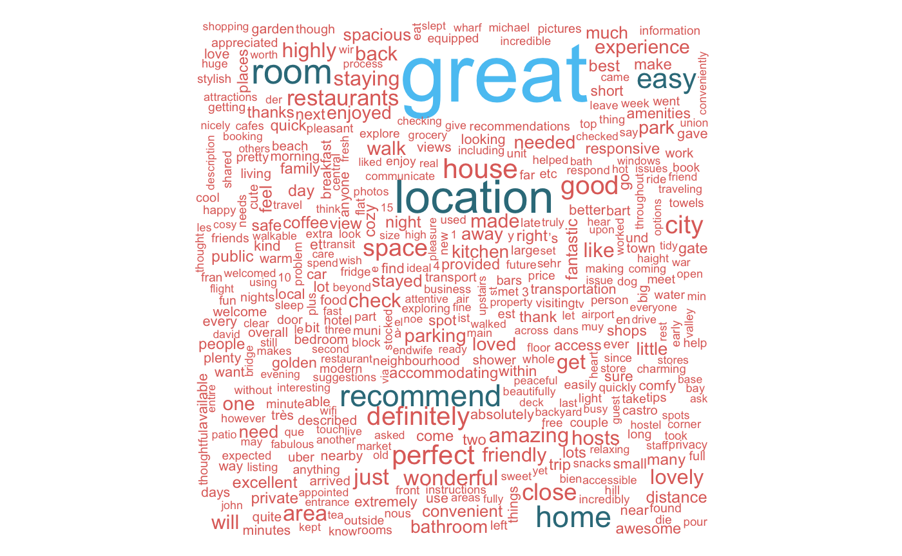
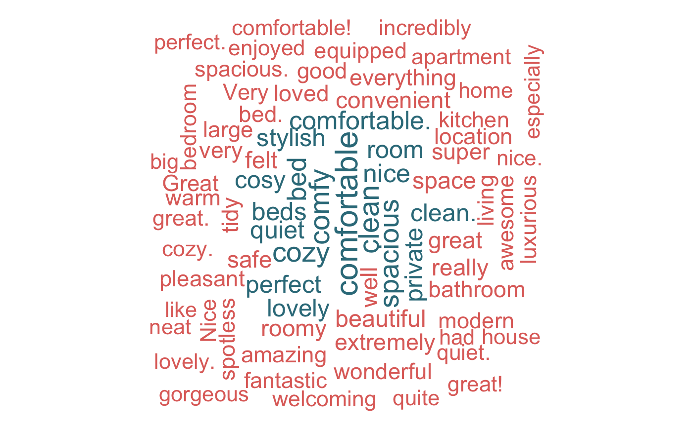
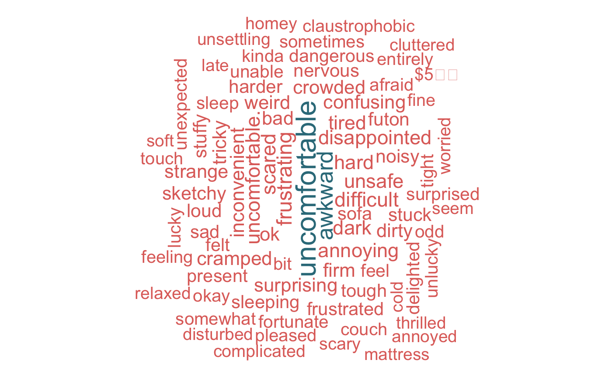

## Introduction|Project description :

\qquad Based on the Airbnb data and the Facility data of San Francisco, both of the data set contains the geographic information of Airbnb and other Facility in SF, including latitude and longitude, and reviews detail, prices, jurisdiction of the facility.  
\qquad I think it will be interesting to explore the data set of Airbnb by its reviews using the text mining analysis, and use the geographic information to seek the connection between the distribution of Airbnb and the facility in a city. Find out if the price of the Airbnb will be different base on the facility of the neighborhood. I can group the Airbnb by Latitude and Longitude. 


## The main questions to explore from the data:

-How positive or negative are the reviews of Airbnb?

-How to cluster Airbnb according to geographic information?

-How to cluster Airbnb according to price in the map?

-How to cluster Airbnb according to facility information of the same city?

-Do the Airbnb and facility clusters in a similar geographic information?

## Data
Source of data:

-The data set was extracted from the tomslee.net website: Airbnb Data Collection, under the section get the data. and the inside airbnb website. To be specific, the data used for this project was collected from the November 2013 to January 2017 in San Francisco. There are 9 variables that will be used in this project.

-There are room id, host id, room type, neighborhood, number of reviews, overall satisfaction, number of accommodates, number of bedrooms and price. 

---

-For the facilities data is extract from the https://data.sfgov.org/d/nc68-ngbr website, it contains 13 variables.  

-facility_id, common_name, address,city, zipcode,block_lot,owned_leased,dept_id,owned_leased,
dept_id, department_name, gross_sq_ft, longitude,katitude,geom.

```{r setup, include=FALSE}
knitr::opts_chunk$set(echo = FALSE,warning=FALSE,message=FALSE,fig.align='center',out.width='80%')
pacman::p_load(ggplot2,tidyverse,stringr,kableExtra,dplyr,sqldf,ggpubr,knitr,leaflet,magrittr,zipcode,tm)
```

## Data cleaning

Because the dataset is very large, we want to extract the information as more useful and informative as possible, so we filter the observation with more than 100 reviews because these could be more representative in general, and extract neighborhood with more than 30 observations for the further modeling analysis. After eliminate all the NA, now we have the cleaned data we need, then we can start our EDA process.


# Exploratory Data Analysis

---

What is the price range for SF Airbnb, what would be a common price we should expect when we are searching the Airbnb in SF?
```{r echo = FALSE,warning=FALSE,message=FALSE,include=FALSE}
files = list.files(pattern = ".csv")
files = files[which(str_detect(files,pattern = "2017"))]
c = setNames(files,paste0("sanf",1:length(files)))
list2env(lapply(c,read.csv),envir = .GlobalEnv)
v.l = intersect(names(sanf5),names(sanf6))
for(i in 1:length(files)){
  assign(x = paste0("sanf", i),value = dplyr::select(get(paste0("sanf", i)),v.l))
}
sanf = sanf1
for(i in 2:length(files)){
  sanf = rbind(sanf,get(paste0("sanf", i)))
}
# filter observations with more than 100 reviews 
sanf.re = sanf %>% filter(reviews > 100)
# count the observations in each neighborhood
count.nerbor = sanf.re %>% count(neighborhood) %>% arrange(desc(n))
# extract neighborhood with more than 30 observations
count.nerbor = count.nerbor %>% filter(n>30)
sanf.re = sanf.re[which(sanf.re$neighborhood %in% count.nerbor$neighborhood),]
# export dataset to CSV file
write.csv(sanf.re,"san_francisco_data_final.csv")
data = read.csv("san_francisco_data_final.csv")
Airbnb = data[,c(2:14)]
#eliminate all the NA value.
SFAirbnb = subset(Airbnb, select = -c(borough,minstay))
unique <- SFAirbnb %>% group_by(room_id) %>% summarise(reviews = mean(reviews), rating= mean(overall_satisfaction),price= mean(price),lat= mean(latitude),lon=mean(longitude))
```
```{r echo=FALSE,warning=FALSE}
#create a histgram of the distribution of price from 30 to 300, since this range will be the majority of price fall in.
c=ggplot(SFAirbnb, aes(price))+ geom_histogram(binwidth = 5, color = "black", fill = "pink")+ 
ggtitle("Figure 1. Distribution of room price") + 
ylab ("frequency of price") + xlab("Price") + xlim(30,300)+theme(plot.title = element_text(size = (8)))

#since the response varible, price is not normal distributed, we are going to do log transformation on this variable.
df <- SFAirbnb %>% mutate(logprice = log(price))
#The distribution plot of transformed price  
d=ggplot(df, aes(log(price)))+ geom_histogram(binwidth = 0.2, color = "black", fill = "pink")+ ggtitle("Figure 2.Distribution of room price") + ylab ("frequency of transformedprice") + xlab("log(Price)")+ xlim(3,7)+theme(plot.title = element_text(size = (8)))

ggarrange(c,d,ncol=2,nrow=1)
```

We take a look at the room price distribution, and it is obvious that the most popular price are around 100, and between 100-150.


---

How many reivew would be a common amount we should expect when we are searching the Airbnb in SF?

```{r echo=FALSE,warning=FALSE}
ggplot(SFAirbnb, aes(reviews))+ geom_histogram(binwidth = 5,color = "black", fill = "pink")+ ggtitle("Figure 3.distribution of number of reviews") + ylab ("frequency of reviews") + xlab("number of reviews")+ xlim(100,250)
```

Since we have already filter the reviews that is less than 100, here the distribution plot can tell us that most of the reviews are around 100 to 175,most of the reivews are ubder 200. 

---

How are the Airbnb rated in SF Airbnb, is there any extreme good or bad rating we should be aware of?
```{r echo=FALSE}
ggplot(SFAirbnb, aes(overall_satisfaction))+ geom_histogram(binwidth = 0.25, color = "black", fill = "pink")+ ggtitle("Figure 4.distribution of overall satisfaction") + ylab ("frequency of overall satisfaction") + xlab("overall_satisfaction")
```
In this histgram plot, most of overall rating is aroud 4.5 and 5. There are also a small portion of people rate the room 3.9  to 4 star. Overall, customers are satisfied with most of rooms in San Francisco area.

---

How are the number of reviews different in each neighborhood?


```{r echo=FALSE,warning=FALSE,fig.align='center',out.width='80%'}
Rating<-sqldf("SELECT overall_satisfaction, COUNT (room_id) FROM SFAirbnb Group by 1")
colnames(Rating)<-c("rating","Num_room")
#create a new dataset called neighborhood.
neighborhood<-sqldf("SELECT neighborhood, COUNT (room_id), Avg(overall_satisfaction),avg(price),avg(reviews) FROM SFAirbnb Group by 1")
#rename the column of the dataset.
colnames(neighborhood)<-c("neighborhood","Num_room", "Avg_rating","Avg_price", "reviews")


ggplot(data=neighborhood, aes(x=reorder(neighborhood,-reviews), y= reviews,fill=neighborhood))+geom_bar(stat = "identity")+ scale_colour_gradientn(colours=rainbow(1)) + ggtitle("Figure 5.Average number of reviews per neighborhood")+ylab("Average # of reviews") + theme(axis.text.x = element_text(angle = 65, hjust = 1))+theme(plot.title = element_text(size = (8)))

```

From these plot, the Potrero Hill area has the highest number of review (over 200), while Excelsior has the lowest average number of reviews beside those less than 100 reviews.

---

How are the number of rating different in each neighborhood?


```{r fig.align='center',out.width='80%'}
ggplot(data=neighborhood, aes(x=reorder(neighborhood,-Avg_rating), y= Avg_rating,fill=neighborhood))+geom_bar(stat = "identity")+ scale_colour_gradientn(colours=rainbow(1)) + ggtitle("Figure 6.Average rating of airbnb rooms per neighborhood")+ylab("Average rating of room") + theme(axis.text.x = element_text(angle = 65, hjust = 1))+theme(plot.title = element_text(size = (8)))


```

 Although there is not much  differnce of rating among different neighborhood, it could be useful just to capture it quantitatively.
 
---

How are the number of  price different in each neighborhood?


```{r fig.align='center',out.width='80%'}
ggplot(data=neighborhood, aes(x=reorder(neighborhood,-Avg_price), y= Avg_price,fill=neighborhood))+geom_bar(stat = "identity")+ scale_colour_gradientn(colours=rainbow(1)) + ggtitle("Figure 7.Average price per neighborhood")+ylab("Average price") + theme(axis.text.x = element_text(angle = 45, hjust = 1))+theme(plot.title = element_text(size = (8)))
```

The area has the highest price is Twin peaks, and lowest is the financial distrist, and most of the neighborhood have the average price around 100-150.

---

What the Average price for different room types:

```{r echo=FALSE }
room_type <- sqldf("SELECT room_type, count(room_id), Avg(overall_satisfaction), avg(price) FROM SFAirbnb Group by 1")
colnames(room_type) = c("room_type","Num_room", "Avg_rating","Avg_price")
ggplot(data = room_type, aes(x= reorder(room_type,-Avg_price),y = Avg_price,fill = room_type)) + geom_bar(stat = "identity", ) + ggtitle("Figure 8.Average price for different room types") + ylab("Average_price")+ xlab("Room_type") 
```

This result is consistent with our common sense and meaning the pricing of Airbnb in San Francisco are reasonable as the bigger the room type has the higher average price.


# Text analysis

## User Review

Dominant themes in the reviews:

```{r fig.align='center',out.width='90%'}

```

---

Location seems to be key, the words "neighbourhood", "location", "area" are featured prominently in the word cloud. Transport options like "subway", "walk"mentioned frequently . Airbnbs are short term rentals, yet people seem to lay stress on the comfort aspect of their stay, words like "kitchen" tell us that many folks would rather cook than eat out. Availability of "Restaurants" close by falso mention often.  The word "Host" finds a lot of mention,indicating the important role that hosts play in shaping the Airbnb experience. 

## Comment Analysis Using Word Cloud

Key word for the positive reviews:

```{r fig.align='center',out.width='90%'}

```

---

From the keyword of the positive reviews we can see that customers really care about if the room is clean, comfortable,and well design. Alos spaccious are favor by customers since it will affact the comfortability of the room.

---

Key word for the negative reviews:

```{r fig.align='center',out.width='90%'}

```

---

Words similar to "uncomfortable" are usually those that occur such as the reasons for the discomfort. The word cloud shows just that - notice words like "cramped", "crowded","small", "stuffy" and "Hot", "damp" and "cold" are some of the common temperature issues. "Dusty", "dirty" and "unclean" surroundings will prompt people to write negative feedback. Many feel "nervous","unsafe" and "loud", clearly a red flag for future tenants.


# Mapping


---

Airbnb price distribution geographically : 
1st Quantile price< 91.29: blue,   2nd Quantile 91.29<price<125: red, 
3rd Quantile 125<price165: orange,  4st Quantile price>165: green 

```{r}
# State boundaries from the maps package. The fill option must be TRUE.
bounds <- map('state', c('California'), fill=TRUE, plot=FALSE)
library(dplyr)
sub_1 = dplyr::filter(unique, unique$price< 91.29)
sub_2 = dplyr::filter(unique,unique$price >91.29, unique$price< 125)
sub_3 = dplyr::filter(unique,unique$price >125, unique$price< 165)
sub_4 = dplyr::filter(unique,unique$price >165)

map <- leaflet(data = unique) %>% addTiles() %>%
  setView(mean(unique$lon),mean(unique$lat), zoom = 12) %>%
   addCircleMarkers(~sub_1$lon, ~sub_1$lat, label = ~sub_1$price,radius =3,color="blue",
                    stroke = FALSE, fillOpacity = 0.8)%>%
  addCircleMarkers(~sub_2$lon, ~sub_2$lat, label = ~sub_2$price,radius =3,color="red",
                    stroke = FALSE, fillOpacity = 0.8)%>%
  addCircleMarkers(~sub_3$lon, ~sub_3$lat, label = ~sub_3$price,radius =3,color="green",
                    stroke = FALSE, fillOpacity = 0.8)%>%
  addCircleMarkers(~sub_4$lon, ~sub_4$lat, label = ~sub_4$price,radius =3,color="orange",
                    stroke = FALSE, fillOpacity = 0.8)%>%
  addProviderTiles(providers$Esri.NatGeoWorldMap) %>%
 # addProviderTiles("CartoDB.Positron", group = "Map") %>%
  #addProviderTiles("Esri.WorldImagery", group = "Satellite")%>% 
  #addProviderTiles("Esri.WorldShadedRelief", group = "Relief")%>%
  # Marker data are from the sites data frame. We need the ~ symbols
  # to indicate the columns of the data frame.
 # addMarkers(~longitude, ~latitude, label = ~jurisdiction, group = "facilities") %>% 
  # addAwesomeMarkers(~lon_dd, ~lat_dd, label = ~locality, group = "Charging",con=icons) %>%
  #addPolygons(data=bounds, group="States", weight=2, fillOpacity = 0) %>%
  addScaleBar(position = "bottomleft") %>%
  addLayersControl(
    baseGroups = c("Map", "Satellite", "Relief"),
    overlayGroups = c("facilities", "States"),
    options = layersControlOptions(collapsed = T)
  )
map
```

---

The map give us a general idea about how the price distributed in the San Fransico area, four color of the dot are representing four different price level for the Airbnb room, and we can se that the for are very spread out in the map, so there is not an area will have very extrem price value.

---


Higher price distribution comparing few facility type  geographically : 
4st Quantile price>165: green, Recreation And Parks: teal,      
School District (Sfusd):black,  War Memorial: white,   
Municipal Transportation Agency:yellow     

```{r echo=FALSE,include=FALSE,warning=FALSE}
library(readr)
City_Facilities <- read_csv("City_Facilities.csv")
a = subset(City_Facilities, select = -c(city,block_lot))
data_f = a[,c(1:11)]
dataf=na.omit(data_f)
write.csv(dataf,"dataf.csv")
data<- read.csv("dataf.csv")
facilities = data %>% dplyr::select(longitude, latitude, jurisdiction,zip_code,geom)
write.csv(dataf,"facilities.csv")
```
```{r}
# State boundaries from the maps package. The fill option must be TRUE.
bounds <- map('state', c('California'), fill=TRUE, plot=FALSE)
library(dplyr)
sub_1 = dplyr::filter(unique, unique$price< 91.29)
sub_2 = dplyr::filter(unique,unique$price >91.29, unique$price< 125)
sub_3 = dplyr::filter(unique,unique$price >125, unique$price< 165)
sub_4 = dplyr::filter(unique,unique$price >165)

sub_5 = filter(facilities, grepl("Art",  jurisdiction))
sub_6 = dplyr::filter(facilities,facilities$jurisdiction== "Recreation And Parks")
sub_7 = dplyr::filter(facilities,facilities$jurisdiction== "School District (Sfusd)")
sub_8 = dplyr::filter(facilities,facilities$jurisdiction== "War Memorial")
sub_9 = dplyr::filter(facilities,facilities$jurisdiction== "Municipal Transportation Agency")
map1 <- leaflet(data = unique) %>% addTiles() %>%
  setView(mean(unique$lon),mean(unique$lat), zoom = 12) %>%
   #addCircleMarkers(~sub_1$lon, ~sub_1$lat, label = ~sub_1$price,radius =3,color="blue", stroke = FALSE, fillOpacity = 0.8)%>%
 # addCircleMarkers(~sub_2$lon, ~sub_2$lat, label = ~sub_2$price,radius =3,color="red", stroke = FALSE, fillOpacity = 0.8)%>%
  #addCircleMarkers(~sub_3$lon, ~sub_3$lat, label = ~sub_3$price,radius =3,color="green", stroke = FALSE, fillOpacity = 0.8)%>%
  addCircleMarkers(~sub_4$lon, ~sub_4$lat, label = ~sub_4$price,radius =3,color="orange", stroke = FALSE, fillOpacity = 0.8)%>%
  addCircleMarkers(~sub_5$lon, ~sub_5$lat, label = ~sub_5$jurisdiction,radius =3,color="purple",
                    stroke = FALSE, fillOpacity = 0.8)%>%
  addCircleMarkers(~sub_6$longitude, ~sub_6$latitude, label = ~sub_6$jurisdiction,radius =3,color="teal",
                    stroke = FALSE, fillOpacity = 0.8)%>%
   addCircleMarkers(~sub_7$longitude, ~sub_7$latitude, label = ~sub_7$jurisdiction,radius =3,color="black",
                    stroke = FALSE, fillOpacity = 0.8)%>%
    addCircleMarkers(~sub_8$longitude, ~sub_8$latitude, label = ~sub_8$jurisdiction,radius =3,color="white",
                    stroke = FALSE, fillOpacity = 0.8)%>%
   addCircleMarkers(~sub_9$longitude, ~sub_9$latitude, label = ~sub_9$jurisdiction,radius =3,color="yellow",
                    stroke = FALSE, fillOpacity = 0.8)%>%
  addProviderTiles(providers$Esri.NatGeoWorldMap) %>%
 # addProviderTiles("CartoDB.Positron", group = "Map") %>%
  #addProviderTiles("Esri.WorldImagery", group = "Satellite")%>% 
  #addProviderTiles("Esri.WorldShadedRelief", group = "Relief")%>%
  # Marker data are from the sites data frame. We need the ~ symbols
  # to indicate the columns of the data frame.
 # addMarkers(~longitude, ~latitude, label = ~jurisdiction, group = "facilities") %>% 
  # addAwesomeMarkers(~lon_dd, ~lat_dd, label = ~locality, group = "Charging",con=icons) %>%
  #addPolygons(data=bounds, group="States", weight=2, fillOpacity = 0) %>%
  addScaleBar(position = "bottomleft") %>%
  addLayersControl(
    baseGroups = c("Map", "Satellite", "Relief"),
    overlayGroups = c("facilities", "States"),
    options = layersControlOptions(collapsed = T)
  )
map1
```

---

From this map, we can see that the higher price of the room kind of follow the distribution of the School District, but not with the parks, and other types of the facilities. Maybe this is because the visitors who choose to use Airbnb are mostly visiting students or want to visit the university such as UC Berekly, also the area near school are usually convient with all kind of transportation and stores. Therefore around the school zone, the airbnb has higher price in this area is reasonable.


